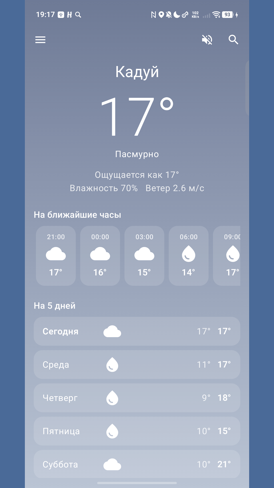
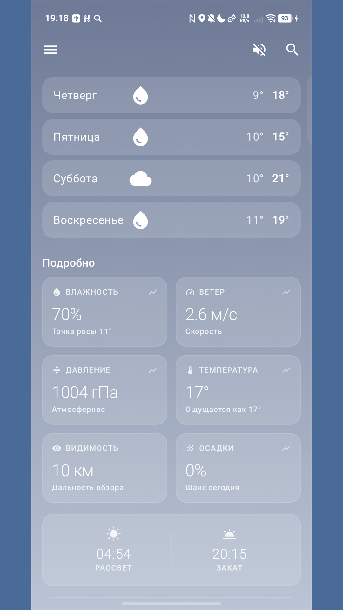
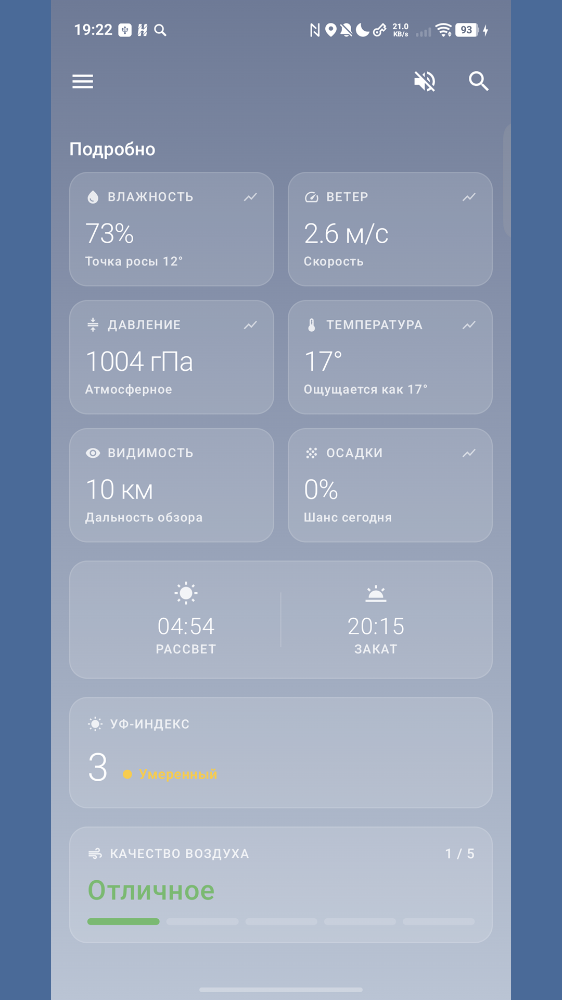
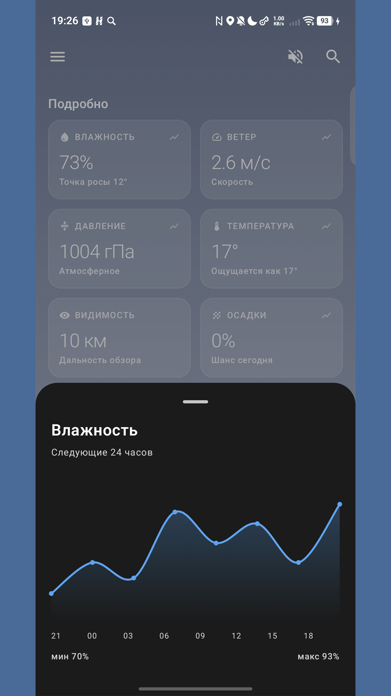

# Æther - Weather App for Android

  
  
  
  
  

Minimalist weather app focused on readability and detail. No ads, no trackers - just weather, designed to be pleasant to look at.

## Features

- Current weather by geolocation or any city
- Hourly forecast and 5-day outlook
- UV index and Air Quality (AQI) with visual scale
- Detailed metrics: humidity, dew point, pressure, wind, visibility, precipitation chance
- Sunrise & sunset times
- Tap any metric card → smooth 24h chart
- Dynamic gradient background based on weather & time of day
- Ambient nature sounds (rain, thunderstorm, wind)

## Widgets

Three home screen widget sizes built with Glance:
- **Compact 2×1** — icon + temperature
- **Medium 2×2** — city, temperature, description
- **Wide 4×2** — plus min/max and "feels like"

## Tech Stack

| Layer | Technology |
|-------|-----------|
| Language | Kotlin |
| UI | Jetpack Compose (Material 3) |
| Widgets | Glance (Compose for App Widgets) |
| Network | Retrofit + OkHttp + kotlinx-serialization |
| Async | Coroutines + Flow / StateFlow |
| Storage | DataStore Preferences |
| Location | Google Play Services Location |
| Splash | AndroidX Core-SplashScreen |
| Weather API | OpenWeather |

**minSdk** 26 (Android 8.0) · **targetSdk** 36

## Download

## Privacy

Location is used solely for weather requests and is never shared with third parties.

## License

This repository is a showcase — source code is not included.
