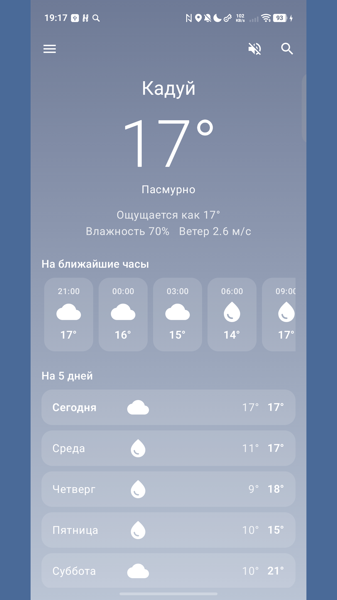
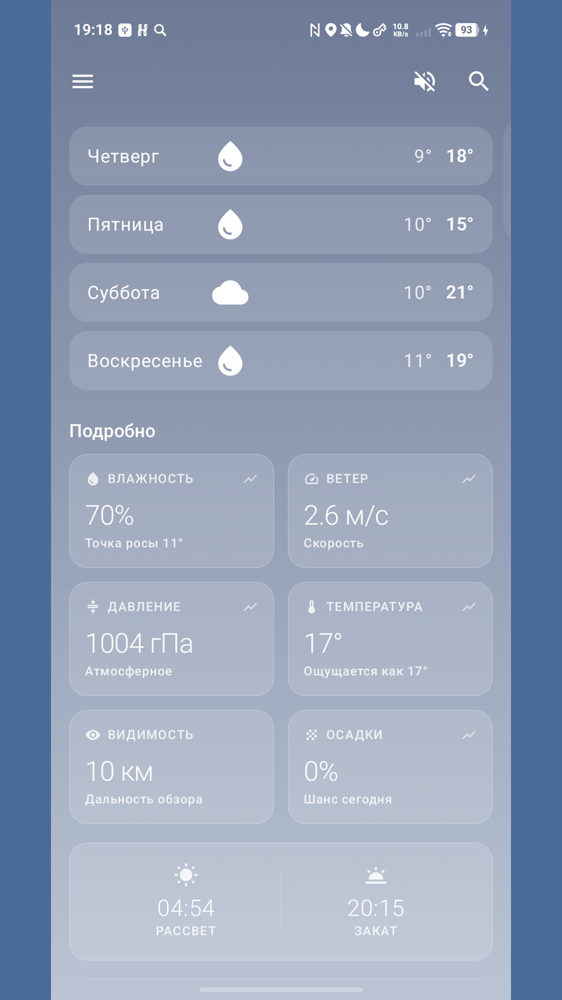
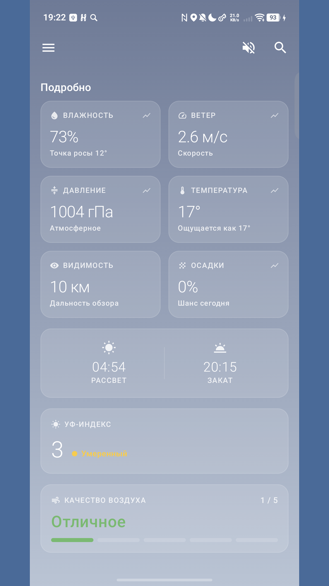
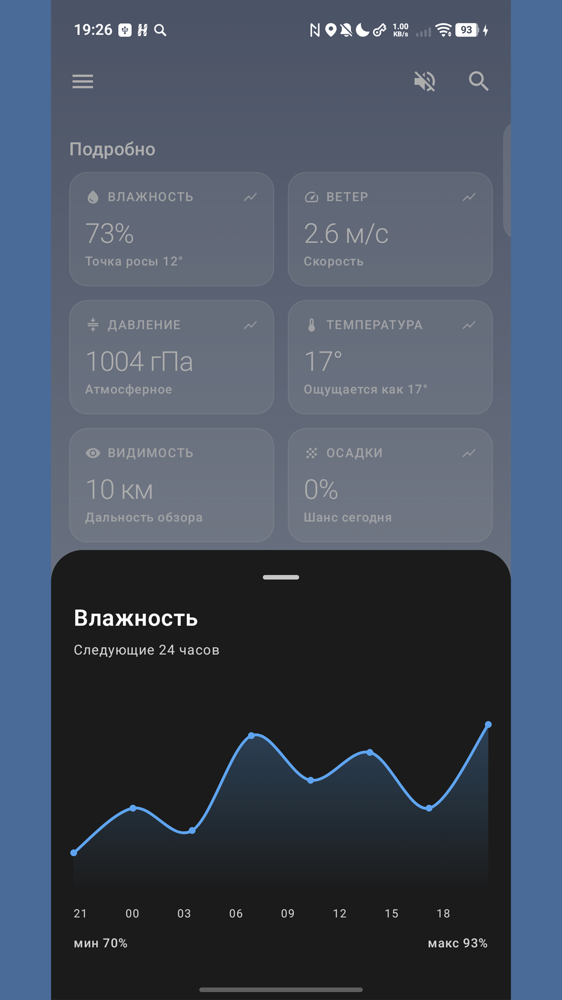

# Æther - Weather App for Android

  
  
  
  
  

Minimalist weather app focused on readability and detail. No ads, no trackers - just weather, designed to be pleasant to look at.

## Features

- Current weather by geolocation or any city
- Hourly forecast and 5-day outlook
- UV index and Air Quality (AQI) with visual scale
- Detailed metrics: humidity, dew point, pressure, wind, visibility, precipitation chance
- Sunrise & sunset times
- Tap any metric card → smooth 24h chart
- Dynamic gradient background based on weather & time of day
- Ambient nature sounds (rain, thunderstorm, wind)

## Widgets

Three home screen widget sizes built with Glance:
- **Compact 2×1** — icon + temperature
- **Medium 2×2** — city, temperature, description
- **Wide 4×2** — plus min/max and "feels like"

## Tech Stack

| Layer | Technology |
|-------|-----------|
| Language | Kotlin |
| UI | Jetpack Compose (Material 3) |
| Widgets | Glance (Compose for App Widgets) |
| Network | Retrofit + OkHttp + kotlinx-serialization |
| Async | Coroutines + Flow / StateFlow |
| Storage | DataStore Preferences |
| Location | Google Play Services Location |
| Splash | AndroidX Core-SplashScreen |
| Weather API | Open-Meteo |

**minSdk** 26 (Android 8.0) · **targetSdk** 36

## Download

## Privacy

Location is used solely for weather requests and is never shared with third parties.

## Code Samples

The full project is closed, but a few self-contained parts are published in [`samples/`](samples) to show how the app is built. They are real files from the app, unchanged, and they don't compile on their own.

| What | File | Notes |
|------|------|-------|
| Weather effects | [`ui/effects/`](samples/ui/effects) | Rain, snow, stars, sun and thunder drawn on a Compose `Canvas`, driven by `withFrameNanos`. Tap the rain to make ripples. |
| Effect switcher | [`WeatherEffects.kt`](samples/ui/effects/WeatherEffects.kt) | Picks the effect from the weather code and day/night. |
| 24h chart | [`HourlyChart.kt`](samples/ui/charts/HourlyChart.kt) | Smooth line chart with a gradient fill, drawn by hand without a chart library. |
| Dynamic background | [`WeatherPalette.kt`](samples/ui/theme/WeatherPalette.kt) | Gradient palette chosen by weather and time of day. |
| Splash screen | [`AetherSplash.kt`](samples/ui/splash/AetherSplash.kt) | Animated launch screen. |
| Home screen widget | [`WeatherWidgetWide.kt`](samples/widget/WeatherWidgetWide.kt) | The wide 4×2 widget built with Glance. |
| Weather codes | [`WmoWeather.kt`](samples/data/model/WmoWeather.kt) | Maps Open-Meteo WMO codes to icons and descriptions. |

## License

This repository is a showcase. The files in `samples/` are published for reading only; the rest of the source code is not included.
